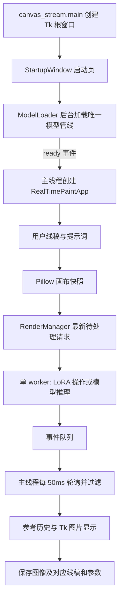

# AniFace 项目完整技术说明与面试准备

更新日期：2026-09-19。以当前工作区源码、固定依赖及本地验证记录为准。

配套新增（2026-09-21）：[核心源码逐函数学习手册](CODE_WALKTHROUGH.md)，用于对照实际代码逐段学习，覆盖 76 个核心函数、配置项与代表性测试/工具。本文继续负责技术原理、设计取舍与面试表达。

本文按“做什么 → 如何运行 → 技术原理 → 具体实现 → 如何验证 → 如何讲给面试官听”组织。涉及第三方算法时，会区分算法本身与本项目实际编写的代码。标为“简化示意”的代码帮助理解，不是另一套可直接替换项目的实现。

## 阅读路线

- 第一次阅读：先看第 1–4 章，建立整体认识。
- 理解模型：第 5–9 章，弄清 PyTorch、Stable Diffusion、ControlNet、采样器和 LoRA 的关系。
- 理解程序：第 10–16 章，跟着输入、线程、版本、错误和文件保存走一遍。
- 准备面试：第 17–22 章，掌握证据、取舍、表达和追问。

目录：

1. [产品目标与当前完成度](#s1)
2. [技术栈总览](#s2)
3. [目录与代码职责](#s3)
4. [从启动到保存的完整流程](#s4)
5. [PyTorch、CUDA 与推理执行](#s5)
6. [Stable Diffusion、CLIP、U-Net、VAE](#s6)
7. [Diffusers 与采样参数](#s7)
8. [ControlNet 与线稿处理](#s8)
9. [LoRA、PEFT 与角色预设](#s9)
10. [Tkinter 事件循环与绘画交互](#s10)
11. [Pillow、坐标变换与撤销](#s11)
12. [线程、队列和请求调度](#s12)
13. [epoch、version 与连续绘画](#s13)
14. [模型操作的失败恢复](#s14)
15. [参考历史与可追溯保存](#s15)
16. [Python 工程知识点](#s16)
17. [测试、指标和证据](#s17)
18. [环境、依赖和复现](#s18)
19. [局限与改进顺序](#s19)
20. [面试介绍与简历表述](#s20)
21. [常见追问与回答](#s21)
22. [阅读练习与掌握清单](#s22)

<a id="s1"></a>
## 1. 产品目标与当前完成度

AniFace 是本地桌面绘画辅助原型。目标用户是同人画师和绘画初学者：用户选定角色或画风，通过线稿表达姿势、构图和表情，程序持续生成参考图片，帮助用户决定接下来怎样画。

这里有三个不同的控制维度：

| 维度 | 用户希望控制什么 | 当前对应机制 |
|---|---|---|
| 空间结构 | 人数、位置、姿态、轮廓 | 线稿输入 + ControlNet |
| 语义与风格 | 角色特征、画风、表情描述 | 基础模型 + 提示词 + 可选 LoRA |
| 参考使用方式 | 什么时候更新、保留哪一张 | 暂停生成、固定参考、历史浏览、手动精细生成 |

**产品目标不等于已验证能力。** 已实现角色/画风预设加载和配置固定，但尚未选定真实角色 LoRA 做完整一致性验收。不要在面试中说“任意角色已经稳定锁定”。

当前可运行功能包括：画布绘制与导入、橡皮擦、笔刷尺寸、缩放和平移、撤销/重做、连续预览、精细生成、LoRA 加载/调权重/卸载、角色/画风预设、固定参考、12 张历史及带生成信息的 PNG 保存。

当前没有实现：模型训练、参考图身份编码、上一帧 latent 复用、局部重绘蒙版、图层系统、压感、云端多用户服务、数据库、Web 前后端、TensorRT/ONNX 推理或 StreamDiffusion。不能把曾经讨论过的方案写成当前技术栈。

“实时”在这里指秒级连续交互反馈。当前不是 30 FPS 视频生成，也不是每次鼠标移动都完成一张图。

<a id="s2"></a>
## 2. 技术栈总览

版本来自 [requirements.txt](<D:/code project/AniFaceProject/requirements.txt>)。这是项目的兼容组合，不是对最新版本的推荐。

| 技术 | 项目版本/来源 | 作用 | 在项目里怎样使用 |
|---|---|---|---|
| Python | 建议 3.10/3.11；本机验证 3.10.20 | 应用编排、状态管理、工具与测试 | 所有业务代码 |
| Tkinter / ttk | Python 标准库及 Tk 运行时 | 窗口、按钮、画布、事件循环 | `app.py`、`startup.py` |
| Pillow | 12.2.0 | 像素图绘制、缩放、格式转换、PNG 信息 | `Image`、`ImageDraw`、`ImageOps`、`ImageTk` |
| PyTorch | 2.5.1；本机 CUDA 构建 2.5.1+cu121 | 张量计算、GPU 推理、随机数 | dtype/device、Generator、inference_mode |
| Diffusers | 0.24.0 | 组合扩散模型、ControlNet 和采样器 | 管线加载、调用和适配器接口 |
| Transformers | 4.36.2 | 文本分词与 CLIP 文本模型等组件 | 由扩散管线加载和调用，本项目没有自写文本模型 |
| PEFT | 0.7.1 | 适配器能力，支持 LoRA 后端 | Diffusers 的适配器路径；测试也直接生成 LoRA fixture |
| Accelerate | 0.25.0 | 模型加载生态中的设备/内存支持 | 安装依赖；没有自行编写分布式训练或多 GPU 调度 |
| huggingface-hub | 0.20.3 | 模型仓库下载、版本快照与缓存 | `from_pretrained` 的底层模型获取 |
| safetensors | 0.7.0 | 张量权重存储格式 | 模型及适配器权重读取/测试保存 |
| NumPy | 1.26.4 | 图像/张量生态的数组兼容依赖 | 当前核心算法不是自写 NumPy 数值实现 |
| threading / queue | 标准库 | 后台任务、同步与事件传递 | Thread、Condition、Event、Queue |
| dataclasses / json / pathlib | 标准库 | 数据对象、配置、元数据、路径 | 请求、事件、预设、参考图 |
| unittest / mock | 标准库 | 自动测试、依赖替换 | 不加载模型也能测调度和 GUI 行为 |
| Git / venv / pip | 工程工具 | 版本管理、隔离、依赖安装 | 源码与大模型/生成产物分开管理 |

可以把层次理解成：业务 Python 决定“何时做什么”；Diffusers 决定“一次扩散生成怎样组织”；PyTorch/CUDA 执行“模型计算”；Tkinter/Pillow 负责“人与图片怎样交互”。

<a id="s3"></a>
## 3. 目录与代码职责

| 文件/目录 | 主要职责 | 阅读重点 |
|---|---|---|
| [canvas_stream.py](<D:/code project/AniFaceProject/canvas_stream.py>) | 入口、日志、创建唯一 Tk 根窗口 | `main()`、`root.mainloop()` |
| [config.py](<D:/code project/AniFaceProject/config.py>) | 模型 ID、步数、种子、时间阈值 | 哪些默认参数影响质量、速度、调度 |
| [src/startup.py](<D:/code project/AniFaceProject/src/startup.py>) | 启动加载、进度、失败重试 | `ModelLoader` 与 `StartupWindow` 的分工 |
| [src/pipeline.py](<D:/code project/AniFaceProject/src/pipeline.py>) | 加载管线、输入转换、单次推理 | `create_pipelines`、`prepare_control_image`、`render_sketch` |
| [src/renderer.py](<D:/code project/AniFaceProject/src/renderer.py>) | 后台调度、结果过滤、LoRA 操作 | `RenderManager` 及请求/事件对象 |
| [src/app.py](<D:/code project/AniFaceProject/src/app.py>) | 画板、用户交互、显示和状态协调 | `_draw_to`、`_poll_renderer`、`_open_profile` |
| [src/profiles.py](<D:/code project/AniFaceProject/src/profiles.py>) | 角色/画风 JSON 校验 | 配置兼容性与相对路径解析 |
| [src/prompts.py](<D:/code project/AniFaceProject/src/prompts.py>) | 表情标签组合 | 不直接污染用户输入，不重复追加相同标签 |
| [src/references.py](<D:/code project/AniFaceProject/src/references.py>) | 参考图快照和保存 | 图片与对应线稿、参数绑定 |
| `tests/` | 自动化回归 | 测业务性质，而非只测函数能否被调用 |
| `tools/` | 显式运行的 GPU/压力/画质工具 | 默认输出分别进入 checks/evaluations |
| `profiles/` | JSON 模板及使用说明 | 示例不包含真实角色模型 |
| `artifacts/checks/` | 性能、窗口、回归测试产物 | 原始 metrics.json 是指标依据 |
| `artifacts/evaluations/` | 画质实验 | 图片、人工结论与参数配套保留 |
| `artifacts/environment/` | 安装报告与清理记录 | 当前运行不依赖已删除的验证环境 |
| `artifacts/model-cache/` | 本项目指定目录下载的实验控制模型 | 不等于所有基础模型都缓存于这里 |
| `docs/` | 当前说明、评估报告、历史交接 | 当前实现以本指南和源码为准 |

模块拆分的理由：单次推理不应知道哪个按钮被点击；后台调度不应操作 Tk 控件；PNG 保存不应重新读取当前提示词。分开后可以分别测试这些规则。

<a id="s4"></a>
## 4. 从启动到保存的完整流程



### 4.1 启动

入口先配置控制台和文件日志，然后创建 `tk.Tk()`。`StartupWindow` 显示加载页，`ModelLoader` 在线程中调用 `create_pipelines()`。

加载按阶段发消息：初始化推理环境、加载 ControlNet、加载基础绘画模型、移到设备、配置采样器。进度条是“不确定进度条”，代表仍在工作，不是网络下载百分比。

主线程收到 `ready` 后销毁启动页的 Frame，复用同一个根窗口创建画板。不是再启动第二个 `mainloop`，也不是创建多个独立 Tk 根对象。

### 4.2 一次落笔

按下鼠标保存撤销快照，移动时修改 Pillow 图像；画布刷新来自同一张图。达到请求间隔后，复制线稿并提交预览。后台有空时取最新输入推理，主线程再接收、过滤并显示结果。

松开鼠标会再提交一次预览，确保最后一段笔画进入请求。只有用户启用了自动精细选项，才安排停笔 800ms 后的 HQ 请求；默认由按钮手动触发。

### 4.3 保存

保存的是“当前显示的 Reference”，不是重新组合“当前画布 + 当前提示词 + 某张旧图”。如果参考已经固定，画布可以继续变化，保存仍对应固定图生成时的输入。

<a id="s5"></a>
## 5. PyTorch、CUDA 与推理执行

### 5.1 Tensor 和设备

Pillow 图像是 CPU 侧图像对象。模型计算需要 Tensor：带形状、数据类型和设备信息的多维数组。Diffusers 负责图像预处理和 Tensor 转换，再调用 PyTorch 模型。

`create_pipelines()` 使用 `torch.cuda.is_available()` 判断是否有 CUDA；CUDA 选 `torch.float16`，CPU 选 `torch.float32`，随后 `pipe.to(device)` 将模型准备到该设备。

FP16 每个标量通常占 2 字节，FP32 为 4 字节。更低精度有助于降低权重/部分激活内存，并可能利用 GPU 的低精度计算能力；实际显存和速度不会简单按一半计算，还受算子、缓存、中间张量等影响。项目没有量化到 INT8，也没有显式启用 autocast 混合精度训练。

### 5.2 inference_mode

推理入口使用：

```python
with torch.inference_mode():
    result = pipe(...)
```

它表示不为这次前向计算构建训练所需的梯度记录，并进一步减少部分自动求导跟踪开销。项目没有 `loss.backward()`、优化器或参数更新循环。

它与 `model.eval()` 不是一回事：前者约束自动求导行为，后者切换某些层的训练/评估模式。不能说使用 inference_mode 就“训练完成”或“自动设置所有层为 eval”。模型具体加载状态由库管理。

### 5.3 随机种子

每次生成创建 `torch.Generator(device="cpu").manual_seed(config.SEED)`，默认种子 42，再传给管线。CPU Generator 不代表所有推理都在 CPU；噪声生成与模型计算设备是不同问题。

固定种子可以在相同条件下减少随机性，但输入、步数、模型权重或设备数值实现变了，结果仍可能不同。每次都新建相同种子的 Generator，意味着从相同随机序列起点开始；不是继承上一张结果的 latent。

### 5.4 GPU 计时与显存

CUDA 运算通常异步提交。用 CPU 时钟紧贴一个 GPU 调用计时，可能只测到提交时间。`tools/benchmark.py` 在测量边界调用 `torch.cuda.synchronize()`，并先预热，减少首次初始化对常规推理时间的影响。

`max_memory_allocated()` 主要反映张量占用峰值；`max_memory_reserved()` 反映 PyTorch 缓存分配器保留的峰值。它们与任务管理器看到的进程 GPU 总显存不完全等价。调用 `empty_cache()` 也不能释放仍被对象引用的活跃张量。

面试重点：本项目的优化主要是调度、复用模型和精度选择；没有自写 CUDA 内核，也没有测出“线程越多 GPU 越快”的结论。

<a id="s6"></a>
## 6. Stable Diffusion、CLIP、U-Net、VAE

### 6.1 为什么从噪声生成图

扩散模型学习从带噪信号中预测去噪所需的信息，采样时逐步更新噪声状态。Latent Diffusion 把主要计算放在压缩后的潜空间，降低高分辨率像素空间计算成本。相关算法背景见 [Latent Diffusion 原论文](https://arxiv.org/abs/2112.10752)。本项目加载已有权重，没有训练这个过程。

### 6.2 各组件干什么

| 组件 | 接收什么 | 输出什么 | 当前由谁实现 |
|---|---|---|---|
| Tokenizer | 提示词字符串 | token 编号等文本输入 | Transformers/管线组件 |
| CLIP 文本编码器 | token 序列 | 条件向量序列 | 预训练模型 |
| ControlNet | 线稿条件、当前噪声 latent、时间步和文本条件 | 供 U-Net 使用的空间残差 | 预训练控制模型 |
| U-Net | latent、时间步、文本和控制残差 | 噪声/去噪相关预测 | 预训练基础模型 |
| Scheduler | 预测值、当前时间步和 latent | 更新后的 latent | UniPCMultistepScheduler |
| VAE decoder | 最终 latent | RGB 图像对应的像素表示 | 预训练 VAE |

这是流程解释，具体张量接口由 Diffusers 组织。典型 SD 1.x 的 512×512 图像使用空间尺度更小的 latent，常见形状是单样本 `1×4×64×64`；实际形状由 U-Net 通道数和 VAE 缩放因子决定，当前业务代码没有把这些通道数硬编码进去。

### 6.3 文本如何影响图像

文本不是直接拼到像素上。编码器把词转成向量，U-Net 的条件计算利用这些向量约束生成。交叉注意力可理解为：图像特征在不同位置查询与哪些文本特征相关。这里没有调用聊天模型理解整幅画，也没有对提示词进行复杂语义规划。

### 6.4 当前不是传统 img2img 上色

代码调用的是 `StableDiffusionControlNetPipeline`。线稿作为 ControlNet 的条件图传入 `image=`，不是先把原画编码成 VAE latent 再按 `strength` 加噪重建的 img2img 流程。

因此不应把 `control_guidance_end=0.35` 解释为“原图保留 35%”，也不能说“线稿输入 VAE 后直接上色”。当前主要生成 latent 从随机噪声开始，结构通过 ControlNet 注入，最后由 VAE 解码。

### 6.5 Classifier-Free Guidance

当前调用没有显式覆盖 `guidance_scale`；核对本机 Diffusers 0.24.0 的调用签名后，其默认值为 7.5。代码也没有显式设置负向提示词。

本机管线中的引导组合可以概括为：

```text
预测 = 无文本条件预测 + guidance_scale × (文本条件预测 − 无文本条件预测)
```

这表达的是文本引导的放大，不是 ControlNet 权重，也不是 LoRA 权重。更强的文本引导不必然提高画质，可能增加失真；当前项目没有为这一参数建立系统调优结论。

<a id="s7"></a>
## 7. Diffusers 与采样参数

### 7.1 from_pretrained 到底做了什么

`ControlNetModel.from_pretrained(...)` 读取控制模型配置和权重；`StableDiffusionControlNetPipeline.from_pretrained(..., controlnet=controlnet)` 组合基础模型所需的文本、去噪、VAE 等组件与控制模型。

模型 ID 是查找配置与权重的仓库标识，不是“在线调用远程出图 API”。已有缓存时可以本地加载；加载后实际推理由本机 PyTorch 执行。`local_files_only=True` 约束加载使用本地文件，没有缓存时应失败。

`pipe.scheduler = UniPCMultistepScheduler.from_config(pipe.scheduler.config)` 使用已有采样配置构造新的 scheduler。这里换的是采样更新方法，不是换了 U-Net 权重。

### 7.2 当前实际传入的参数

| 参数 | 当前值/来源 | 具体作用 |
|---|---|---|
| `prompt` | 用户文本 + 表情标签 + 可选预设触发词 | 文本条件 |
| `image` | 预处理后的线稿 | ControlNet 空间条件 |
| `width/height` | 当前线稿尺寸，GUI 为 512×512 | 输出尺寸 |
| `num_inference_steps` | 预览 10，HQ 25 | 采样步数 |
| `generator` | CPU Generator，种子默认 42 | 噪声随机数来源 |
| `controlnet_conditioning_scale` | 1.1 | 控制残差强度 |
| `control_guidance_end` | 默认 0.35、预设值或跟随模式 1.0 | 控制在采样进度中的结束位置 |
| `callback_on_step_end` | 本项目的闭包函数 | 步骤边界检查取消 |
| `clip_skip` | GUI 不设置；实验工具可选 | 实验性文本编码层选择 |

参数含义可对照 [Diffusers 0.24.0 ControlNet 接口](https://huggingface.co/docs/diffusers/v0.24.0/en/api/pipelines/controlnet)。表中的实际值以本地调用代码为依据，库默认参数未全部显式写入配置，因此依赖版本固定很重要。

### 7.3 UniPC 与应用调度的区别

UniPCMultistepScheduler 是扩散采样器，负责用模型预测和采样历史计算下一步 latent。它不负责操作系统线程或决定哪个画布请求先执行。

`RenderManager` 才是应用层任务调度器。一个回答中最好使用“采样器”和“请求调度器”区分它们，避免都简称 scheduler。

当前没有自己实现 UniPC 数学求解器；调用库实现。25 步通常计算量更大，但不保证在任何线稿上都更好。10 步与 25 步走不同的时间步序列，HQ 重新采样，因此不能把它解释成“把 10 步预览补做剩余 15 步”。

更深入一层，本机 `UniPCMultistepScheduler.step()` 会保存 `model_outputs`、`timestep_list`、`last_sample` 和步骤索引；条件满足时先调用校正更新，再维护历史，执行预测更新。这里的 multistep 指利用多步历史信息，不是另开多个线程。开始时历史不足，使用较低阶更新；模型预测负责提供信息，采样器负责数值更新，两者不是同一个网络。

这也给出了共享管线不能随意并发的具体原因：两个生成请求交错修改同一个 scheduler 的历史和索引，可能让它使用另一张图的采样状态。串行化不仅是“加锁更保险”，而是针对真实可变状态的设计。

### 7.4 管线内部的最小执行示意

以下是阅读本机 Diffusers 调用实现后整理的概念伪代码，省略 CFG 批次拼接、dtype、设备、张量形状和其他兼容分支；函数名用于说明职责，不是项目提供的完整 API：

```python
text = encode_prompt(prompt)
condition = preprocess_control_image(sketch)
latent = prepare_random_latents(generator)
prepare_scheduler_timesteps(steps)

for t in timesteps:
    residuals = controlnet_forward(latent, t, text, condition)
    prediction = unet_forward(latent, t, text, residuals)
    prediction = combine_cfg_predictions(prediction)
    latent = scheduler_step(prediction, t, latent)
    check_cancel_at_step_end()

image = vae_decode(latent)
image, flags = run_checker(image)
```

自己编写的 `render_sketch()` 不重复实现这个循环，而是设置条件参数和取消回调后调用库。阅读第三方源码是为了知道调用的实际含义、状态和边界，不必把整个库复制进项目。

<a id="s8"></a>
## 8. ControlNet 与线稿处理

### 8.1 原理与程序接口

ControlNet 给预训练扩散模型增加空间条件控制。原论文的训练设计包含冻结基础模型、可训练控制分支与零初始化卷积连接；本项目只加载训练好的权重。背景见 [ControlNet 原论文](https://arxiv.org/abs/2302.05543)。

在本机 Diffusers 管线中，控制分支返回 `down_block_res_samples` 与 `mid_block_res_sample`，随后分别传给 U-Net 的附加残差参数。可以理解为在多层图像特征中补充“结构应当怎样”的约束，而不是最终生成完再把原线稿覆盖上去。

### 8.2 极性转换

用户输入白底黑线。`prepare_control_image()` 先 `convert("L")` 得到灰度图；Scribble 模式做 `ImageOps.invert`，将白底黑线改成黑底白线，再转回 RGB。

灰度反色是 `新值 = 255 − 旧值`：255 的白变成 0 的黑，0 的黑变成 255 的白。转回 RGB 是为了匹配管线图像输入，不代表恢复丢失的颜色信息。

Lineart 和动漫 Lineart 实验保留白底黑线。控制模型类型通过 `pipe._aniface_control_type` 绑定到管线，推理读取这个值决定转换方式，避免选了模型却忘记配套极性。

当前没有自动边缘检测、照片提线或训练线稿清理网络。输入质量不好时，仅做灰度和反色不一定足够。

### 8.3 强度与控制时间范围

`conditioning_scale=1.1` 控制残差的比例；`control_guidance_end=0.35` 控制采样进度中的结束位置。两者分别影响“多强”和“作用多久”。

由于实际采样步数离散，0.35 不表示精确执行 3.5 个步骤，也不表示耗时的 35%。关闭后仍存在之前采样产生的结构影响，不是瞬间把已有结构擦除。

“尽量跟随线稿”选项覆盖为 1.0，延长结构约束，但可能保留瑕疵或产生纹理问题。当前实验没有证明控制越强越好。全身输入遇上单人头像提示词时，两种条件也可能冲突。

### 8.4 为什么没直接换成 Lineart

实验工具支持 Scribble、通用 Lineart、动漫 Lineart；GUI 默认仍为 Scribble。已有真实线稿实验出现巨大脸部、构图偏离等问题，因此不能凭模型名称更贴近“线稿”就认定一定更适合当前模型和参数组合。实验详情保留在 `docs/reports`。

<a id="s9"></a>
## 9. LoRA、PEFT 与角色预设

### 9.1 LoRA 是什么

低秩适配把一个权重更新近似为两个较小矩阵的乘积。简化表示为 `W_eff = W + λBA`：W 是基础权重，A、B 表示适配器，λ 是推理时的缩放；真实实现还可能包含 alpha/r 等缩放约定。核心背景见 [LoRA 原论文](https://arxiv.org/abs/2106.09685)。

若 W 为 d×k，秩为 r，则两个矩阵的参数量约 r(k+d)，当 r 较小时远少于 dk。这个原理解释的是适配参数较少，不代表叠加适配器后必然零额外显存或零额外运算。

LoRA 原论文面向语言模型；项目使用的是扩散模型生态里的 LoRA 适配器。不要因为库名 PEFT 就说这里训练了大语言模型。

### 9.2 代码真正执行的操作

`load_lora_weights(path, adapter_name=name)` 加载具名适配器；`set_adapters([name], adapter_weights=[weight])` 选择生效适配器和权重；`delete_adapters(name)` 删除指定旧适配器；`unload_lora_weights()` 恢复没有已加载 LoRA 的模型状态。

这些动作全部由渲染 worker 执行。加载新权重会修改模型结构或适配器状态，因此不能让 GUI 一边改模型、另一个线程一边推理。

同一路径已加载时，当前实现直接更新权重，不再次读取整个文件。它按路径字符串判断，不是对文件内容做哈希去重；同一路径文件被外部替换时也不会自动识别内容变化。

### 9.3 预设是配置层，不是第二个模型

`ReferenceProfile` 包含名称、类型、基础模型 ID、LoRA 路径、权重、触发词、默认自由提示词和控制结束比例。`load_profile()` 校验非空字段、支持类型、数值范围和本地路径，并拒绝基础模型 ID 不匹配的配置。

相对 LoRA 路径相对于 JSON 所在目录解析，不是相对于当前工作目录。这样把配置和权重一起放到某个目录时更容易管理。

界面先存 `_pending_profile` 并请求后台加载，收到成功信息后才把它变成 `_profile`。加载失败仍保留旧角色配置。只调同一个预设的 LoRA 权重时，不覆盖用户已经编辑的构图文本。

触发词是适配器作者约定的文本条件，不是密码或代码里的角色 ID。即使触发词固定，仍需要验证适配器质量、基础模型兼容性和不同姿势下的身份稳定性。

### 9.4 LoRA 接口测试与真实身份测试

GPU 测试使用零增量 LoRA：它可以验证加载、权重设置、切换、恢复和推理接口，但没有学会某个真实角色。因此“LoRA 回滚测试通过”和“生成图始终是同一角色”是不同结论。

面试中的准确表述：已实现角色/画风配置与适配器生命周期管理；真实角色身份一致性的效果验收尚未完成。

<a id="s10"></a>
## 10. Tkinter 事件循环与绘画交互

### 10.1 mainloop 为什么不能被推理阻塞

Tkinter 的主线程持续处理鼠标、键盘、定时器、窗口重绘等事件。如果在鼠标回调里直接进行一秒钟的 GPU 推理，这一秒内事件循环不能及时返回处理其他事件，用户就会感到窗口卡住。

因此回调主要做较短的工作：更新画布、提交请求、刷新状态。耗时推理在 worker；主线程使用 `root.after(50, self._poll_renderer)` 定期取结果。`after` 是安排将来的回调，不是创建一个新线程；50ms 也是调度目标，不是操作系统保证的精确周期。

当前所有 Tk 调用都留在主线程，包括变量读取、控件更新、`ImageTk.PhotoImage` 创建和 `after` 安排。后台只接收已复制的图像及普通 Python 数据，不读取 `StringVar`。

### 10.2 StringVar、trace 与回调

提示词使用 `StringVar`，复选框使用 `BooleanVar`，数值使用 `IntVar/DoubleVar`。控件与变量绑定后，`trace_add("write", ...)` 可以在值改变时调用统一处理函数。

写变量也可能触发回调，并不只有人工键盘输入才触发。预设切换时会程序性设置提示词，所以代码用 `_loading_lora` 阻止中间状态产生推理请求，待成功提交预设后再请求预览。

`command=self._request_hq` 传入函数对象；`command=self._request_hq()` 则会在创建按钮时立即执行，语义完全不同。`lambda _e: self._request_hq()` 用于把带事件参数的 Tk 回调适配到不需要事件参数的方法。

### 10.3 节流、防抖、合并是三件事

| 机制 | 当前位置 | 想解决的问题 |
|---|---|---|
| 节流 throttle | `_draw_to` 比较 `time.monotonic()` 与上次提交时间，默认间隔 0.15 秒 | 限制连续鼠标事件提交预览的频率 |
| 停笔延后/防抖式安排 | `_defer_hq` 配合 `after_cancel`，可选 800ms | 避免每次小动作都做精细重绘 |
| 最新请求合并 | `_pending_render` 只存一项 | 模型忙时不排几十张过时画布 |

松手后的最后一次预览不受普通移动节流限制，因此 0.15 秒不是所有来源请求的绝对最小间隔。当前提示词变化也会立即提交预览，不应说“所有输入统一做了 150ms 防抖”。

`time.monotonic()` 适合算间隔，因为系统校时不会使它像墙上时钟那样前后跳动；它不是可展示给用户的日历时间。

### 10.4 图片为何必须保留 Python 引用

Tk 控件使用 Tk 图片对象，但 Python 侧若没有保存 `PhotoImage` 引用，对象可能被垃圾回收，导致显示消失。代码将其保存在 `self.tk_img` 和 `self.sketch_tk_img`，让图片生命周期覆盖显示期间。

这与“模型没有生成出来”不同：结果像素可能存在，问题只发生在 UI 对象生命周期。面试排查时应先区分模型结果、Pillow 图像和 Tk 显示对象三层。

### 10.5 固定参考与暂停生成

固定参考：后台仍可生成，新图进入历史，但屏幕保留用户选中的图。取消固定时显示最新历史图。

暂停生成：阻止新请求并使当前任务失效；恢复时提交当前画布。它不等于固定参考，因为前者控制计算，后者控制展示。

浏览上一张/下一张会自动固定参考，避免用户正在比较时被新结果覆盖。精细模式默认手动，也是在保护参考使用过程的稳定性。

<a id="s11"></a>
## 11. Pillow、坐标变换与撤销

### 11.1 唯一画布数据源

`self.sketch_img` 是实际用于推理的 RGB 图像；`ImageDraw.Draw(self.sketch_img)` 直接修改它。显示画布也从这张图生成，没有一套 Tk 矢量线条、一套另行拼装的模型线稿。

一条笔画用上一个点到新点的线段连接，并在端点画圆形补足笔触。只画鼠标事件位置的小圆点会在快速移动时出现断点，连线避免这个问题。

橡皮擦当前是在白底 RGB 图像上画白色，不是图层擦除或恢复底层像素。用户导入带背景内容的图像后，擦除区域同样变白。这个实现适合当前白底线稿约定，但不是通用绘图软件的图层橡皮。

### 11.2 导入与 Alpha

`fit_sketch()` 的顺序是：按 EXIF 修正方向 → 转 RGBA → 等比例缩放到 512×512 内 → 居中贴到白色 RGB 背景。

`ImageOps.contain` 保持宽高比；直接 `resize((512, 512))` 会把长方形原图拉伸。`LANCZOS` 用于导入缩小的重采样，不应描述成“新增模型细节”。

RGBA 多了 Alpha 透明度通道。将透明图像按遮罩合成到白底，可以避免透明区域被意外当成黑色背景。对于单个像素，合成可理解为 `输出颜色 = α×前景 + (1−α)×背景`。

需要注意：保留宽高比后，长图在 512 方形画布内实际占用的横向像素更少，细线仍可能丢失。正确缩放不等于信息无损。

### 11.3 缩放与平移坐标

用户看到的窗口坐标不是一定等于原图坐标。代码先用 `canvas.canvasx/canvasy` 加入滚动偏移，再除以显示缩放比例：

```text
原图 x = 滚动画布中的 x / zoom
原图 y = 滚动画布中的 y / zoom
```

最后将坐标限制在原图范围。200% 显示时，屏幕上移动 20 像素约对应原图 10 像素。显示扩大不会把推理尺寸从 512 改到 1024。

中键平移使用 `scan_mark/scan_dragto` 改变观察位置。当前没有对线稿做模型级超分辨率处理。

### 11.4 撤销/重做为何用快照

开始一笔前把画布复制到 `_undo_stack`，最多保留 30 项；新操作清空 `_redo_stack`。撤销时把当前图放进 redo，再恢复 undo；重做相反。

这是位图快照方案，而不是保存每个笔画命令的 Command 模式。它简单、行为直接，但内存随图像尺寸增加。512×512×3 的裸 RGB 像素约 0.75 MiB，30 份约 22.5 MiB，此外还有对象开销以及其他图像引用。不能将这个估算当作整个进程内存。

以后提高到大分辨率、多图层时，可以研究增量区域或绘图命令历史；当前没有实现这些优化。

<a id="s12"></a>
## 12. 线程、队列和请求调度

### 12.1 为什么只用一个模型 worker

一条 Diffusers 管线包含可变状态，例如采样器的时间步/历史、适配器集合与权重。并发对同一管线调用生成和 LoRA 切换，可能造成状态竞争，也未必提高 GPU 吞吐。

当前设计让一个 worker 独占模型操作，GUI 只提交数据。这和 actor 的“单一执行者拥有状态、外部发消息”思想相似，但项目没有使用专门的 actor 框架。

启动时还有 `AniFace-load` 线程负责加载，加载完成后进入绘画阶段。说“整个程序从始至终只有两个线程”并不准确，库自身也可能有内部线程；准确说法是“绘画阶段模型操作集中在一个应用 worker”。

### 12.2 Condition 管什么

`threading.Condition()` 同时提供关联锁和等待/唤醒机制。其默认关联的是可重入锁，因此代码在持有 Condition 时调用同样获取它的辅助方法，不会因同一线程再次加锁而立即自锁。

worker 用 `wait_for(predicate)` 等待“关闭、待处理 LoRA、待处理图像”任一条件成立。等待会释放关联锁，被唤醒后重新获取锁并检查条件。这样不用一直忙循环占 CPU，也能处理无实际工作时的唤醒。

GUI 在锁内写入待处理请求，调用 `notify()`；worker 在锁内取走请求后释放锁，才进行耗时推理。**锁不覆盖整个 GPU 推理过程**，否则 GUI 无法及时提交新请求或发出取消信号。

### 12.3 Event 与 Queue 各自负责什么

`threading.Event` 表达持久的关闭/取消标记。任何步骤检查 `is_set()` 都能观察到状态，而不要求恰好赶上一次通知。

`queue.Queue` 用于 worker → GUI 的事件传递，支持线程安全的放入和取出。事件可能是图像、错误、LoRA 信息或启动进度。GUI 非阻塞地消费，队列为空就结束本轮轮询。

注意区分：待处理渲染只有一项，但结果事件 Queue 没有设置 `maxsize`，不能声称整个系统的所有队列都严格有界。如果主线程长时间停止消费，事件仍可能积压；当前小型桌面原型尚未增加专门的结果队列上限。

### 12.4 最新请求如何覆盖积压

假设渲染 A 要 1 秒，期间收到 B、C、D：

```text
运行中：A
待处理：B → 被 C 替换 → 被 D 替换
A 结束后：只取 D
```

这不是 FIFO 渲染队列，而是最新状态合并。用户想看到当前画布，把所有历史鼠标事件都变成生成任务只会扩大延迟。业务正确性取决于“结果新鲜且配置一致”，不取决于“每个中间请求都必须执行”。

LoRA 也只保留最新待处理请求，并在下一次图像推理之前优先应用。但已经进入第三方文件加载调用的操作不能凭空消失，需要等待该调用完成。

### 12.5 快照解决什么竞争

`RenderRequest` 保存 `image.copy()`，提示词是已取出的字符串，metadata 使用深复制。如果后台持有 GUI 正在修改的同一张图，推理输入可能在读取时发生变化，导致结果无法对应某个确定画布状态。

复制解决的是输入共享可变状态。它不解决模型内部状态竞争；后者由单 worker 串行化解决。

### 12.6 GIL 不能代替线程安全设计

CPython 的 GIL 限制常规 Python 字节码同时执行，但不保证跨多步状态更新的业务原子性；PyTorch 等原生库也可能释放 GIL，GPU 运算则在另外的执行设备上运行。

因此“有 GIL 所以不用锁”是错误的。使用线程的主要目的，是让界面与耗时加载/推理协作，不是靠 Python 多线程并行执行大量纯 Python 数值循环。

改用进程会增加模型实例、GPU 上下文或跨进程传图的管理成本。当前单窗口单管线场景，线程更直接；若以后做服务化隔离、任务恢复或多 GPU 分配，再重新评估进程架构。

<a id="s13"></a>
## 13. epoch、version 与连续绘画

这是本项目最值得讲深入的工程问题。

### 13.1 为什么“永远取消旧输入”会导致没有输出

模型完成一次预览约一秒，用户移动鼠标可能每几十毫秒更新一次。若每次落笔都取消当前推理，那么旧任务总在完成前被撤销，最终只有停笔才出图。

此前用真实调度器加 250ms 模拟推理复现：24 次任务中 23 次取消，绘画期间没有图，停止后才出现一张。这是调度策略导致的任务饥饿，不等同于 GPU 算力不足。

### 13.2 两类变化不能使用同一条规则

| 变化 | 当前处理 | 原因 |
|---|---|---|
| 同一配置下继续添笔 | soft invalidate | 允许近期预览完成，让用户获得连续反馈 |
| 新笔画打断精细生成 | 使旧 HQ 失效 | 精细输出应针对最新输入 |
| 提示词、控制模式改变 | 新 epoch | 避免把旧语义/旧配置结果当成新结果 |
| 清空、替换画布、LoRA 切换 | 硬失效 | 防止旧画布或旧角色结果混入 |
| 关闭 | shutdown Event | 不再接收或显示任何结果 |

epoch 表示一组允许相互兼容的生成配置/画布上下文；version 表示输入更新序号。它们不是机器学习训练里的 epoch，也不是 Git 版本号。

### 13.3 接受结果的规则

下面是当前判断逻辑的简化表达，省略锁和队列细节：

```python
if shutting_down or request.epoch != current_epoch:
    discard()
elif request.kind == "hq" and request.version != current_version:
    discard()
elif request.kind == "preview" and age_seconds > 5:
    discard()
elif request.version < last_displayed_version:
    discard()
else:
    accept()
```

所以预览可以略落后于当前笔画，但不能跨越角色/配置边界，也不能比已经显示的版本更旧。5 秒是当前配置阈值，不是算法天然常数。阈值太低会让慢设备总是取消，太高则可能显示明显过时的画面。

请求的年龄从提交快照时刻开始，包含等待时间和生成时间；不是只计算纯模型耗时。

### 13.4 为什么完成后还要检查

即使模型生成完成时结果有效，事件进入队列后、GUI 真正取出之前，用户也可能清空画布。因此 `poll_events()` 需要再次检查 epoch、版本及年龄。

这防的是“已完成但尚未展示”的竞态。只在模型入口检查一次，或只在计算结束检查一次，都不能覆盖这段时间窗口。

### 13.5 同一输入从预览升级到 HQ

`_request()` 用图像模式、尺寸、像素字节、提示词和控制结束比例构造 identity。相同输入从 preview 升级到 HQ 不一定增加版本，因此允许先展示预览，再展示同一输入的精细结果。

这个 identity 是内容比较，不是模型缓存；并没有复用上一次推理结果。`tobytes()` 和图像复制有 O(宽×高) 成本，在当前 512 画布下可接受，但以后提升尺寸应重新评估。

### 13.6 为什么只是不取消还不够

如果仅允许旧预览算完，却仍坚持“事件版本必须等于最新版本”才能显示，连续落笔时它照样会被 UI 丢弃。因此这次修复同时改变了取消规则和展示规则，并加入持续输入测试。

这体现一个常见面试知识点：异步系统的正确性要沿“提交—执行—完成—消费”整条链路检查，不能只修某个函数。

<a id="s14"></a>
## 14. 模型操作的失败恢复

### 14.1 协作取消，而不是强杀线程

`render_sketch()` 在开始前、每个去噪步骤结束及最终返回前检查 `should_stop()`。应取消时抛出 `RenderCancelled`，worker 捕获后丢弃，不当作普通错误弹窗。

`callback_on_step_end` 返回 `callback_kwargs`，保留管线期望的回调接口。取消发生在步骤边界，不能保证打断正在执行的单个 GPU kernel；VAE 解码等其他阶段也不一定逐层可取消。

这是协作式取消：工作代码主动提供安全退出点。Python 没有通用、安全的“强制杀死任意线程并恢复所有第三方状态”办法。

### 14.2 LoRA 切换的事务式顺序

```text
保留旧适配器 A
    ↓
加载新适配器 B（唯一名称）
    ↓
激活 B 与新权重
    ↓ 成功
记录 B 为当前状态，再清理 A
```

若加载或激活失败，尝试删除不完整的 B 并重新激活 A 的原权重；没有旧适配器时恢复基础模型。不能先卸载 A 再赌 B 一定加载成功，否则失败时需要重新读取旧文件，恢复更脆弱。

这里借用了事务的“准备、提交、回滚”思想，但不是数据库 ACID 事务，第三方 API 也可能在失败前部分修改状态。

### 14.3 回滚失败与清理失败为什么区别处理

回滚失败：模型实际状态不确定，设置 `_model_error` 并暂停后续推理；需要重新加载/清理或重启，避免继续用未知状态生成。

新适配器已成功生效，但旧适配器删除失败：保留新状态，记录旧名字到 `_retired_adapters`，后续成功切换再尝试清理，并提示可能仍占用显存。

这两个失败影响不同：前者威胁生成状态正确性，后者主要影响资源释放。不能统一用“忽略错误继续”处理，也不必一遇到清理失败就撤销已经成功的切换。

### 14.4 关闭与加载阶段的取消

关闭画板后禁止新请求，设置 shutdown，清空待处理项，主线程用 `join(timeout=0)` 非阻塞检查 worker 是否结束，未结束则 200ms 后再检查。不能在主线程直接无限 `join()`，否则关闭期间窗口又会卡住。

后台线程虽然设置 `daemon=True`，程序仍主动等待正常退出。daemon 是进程结束时的行为设置，不是资源清理保证。

启动页取消在加载阶段边界检查；第三方下载或文件读取没有返回前，不能立即中断。重试也只能在旧加载线程结束后开始，防止两个加载操作同时争用资源。

### 14.5 错误与内容拦截

`RenderBlocked` 表示模型检查器标记了输出，GUI 保留上一次有效参考并说明原因；不是根据“像素全黑”猜测被拦截。正常黑色图片不能仅凭颜色被判为异常。

启动异常事件只保存文字，不把异常对象或 traceback 长期留在队列里，避免间接持有巨大模型对象。完整错误可以写日志供排查。当前普通工作状态、错误和 LoRA 信息分开显示，成功生成不会随便抹去重要的适配器失败说明。

<a id="s15"></a>
## 15. 参考历史与可追溯保存

### 15.1 Reference 是什么

`Reference` 将输出图片、生成时的线稿、metadata 绑定起来。`capture()` 复制两张图片，并深复制参数。这样 GUI 后续改画布或配置，不会悄悄改掉历史记录。

metadata 包含请求提示词、种子、步数、档位、基础模型 ID、控制类型与参数、实际生效 LoRA、预设、版本号和提交时刻等。它来自 worker 完成时的实际模型状态与该请求，不来自用户后来输入的新设置。

当前引用历史最多 12 张；被固定的参考通过单独对象引用保留，因此即使它不再位于最近历史列表里，也不会因列表裁剪立刻消失。

### 15.2 为什么保存 PNG 内嵌信息

`Reference.save()` 先把线稿写入 `BytesIO`，再 Base64 编码，使用 `PngInfo.add_itxt()` 写入两个字段：

| 字段 | 内容 |
|---|---|
| `aniface.recipe` | UTF-8 JSON 生成参数 |
| `aniface.sketch.png.base64` | 线稿 PNG 的 Base64 文本 |

Base64 是二进制到文本的编码，不是加密，也不是压缩；一般会增加编码长度。`BytesIO` 是内存字节流，使中间线稿不必先写临时文件。

把信息放进同一个 PNG 方便携带；代价是文件变大，图片编辑器重新保存时可能删除附加字段。它还不是完整工程格式，没有全部历史、图层和模型文件。

### 15.3 读取保存信息的示例

下面是独立学习示例，路径需要替换成自己的已保存文件；并非 GUI 已提供“重开工程”按钮。

```python
import base64
import json
from io import BytesIO
from PIL import Image

with Image.open("saved-reference.png") as image:
    recipe = json.loads(image.info["aniface.recipe"])
    encoded = image.info["aniface.sketch.png.base64"]
    sketch = Image.open(BytesIO(base64.b64decode(encoded)))
    sketch.load()
print(recipe["prompt"], recipe["seed"])
```

### 15.4 可追溯不等于完全可复现

当前记录了模型 ID/路径，但没有完整锁定所有模型 revision、LoRA 内容哈希、库版本、驱动版本、采样器细节和确定性设置。模型同名文件被换掉后，同一参数也可能生成不同结果。

`submitted_at` 使用单调时钟，适合当前进程内计算年龄，不能作为跨进程绝对时间。界面中的快照到显示数值也主要围绕事件消费记录，不是高精度屏幕光子延迟测量。

<a id="s16"></a>
## 16. Python 工程知识点

### 16.1 dataclass 和 frozen

`RenderRequest`、`RenderEvent`、`LoadEvent`、`ReferenceProfile` 用 dataclass 表达有固定字段的数据。自动生成构造函数等方法，避免用不明含义的长元组到处传参数。

`frozen=True` 阻止直接给字段重新赋值，但不会递归冻结字段里的 PIL 图像或 dict。因此“frozen 请求”并不自动保证图像不会被修改，代码仍要复制输入。这个区别很适合面试追问。

### 16.2 浅复制与深复制

复制外层 dict 仍可能共享内部嵌套 dict；例如预设字段里还有配置内容。metadata 使用 `deepcopy`，以免历史参数随当前配置对象修改。PIL 图像则用它自己的 `copy()` 复制像素数据。

并非所有对象都适合深复制，例如整个 GPU 管线。项目只复制轻量输入快照，不复制模型来隔离每次任务。

### 16.3 依赖注入

`RenderManager(pipe, render_fn=render_sketch)` 和 `ModelLoader(factory=create_pipelines)` 允许传入替代函数。正式运行使用真实模型；测试传入可控的 fake 函数，用同步事件决定何时完成、何时失败。

这使测试可以精确制造“推理完成前发生清空”“加载失败后重试”等情形，而不必等待真实 GPU 碰巧出现竞态。

### 16.4 闭包与取消回调

`on_step_end` 读取外层的 `should_stop`，属于闭包；worker 传入的 lambda 根据当前请求判断是否过期。回调表达“到这个执行点时重新检查状态”，不是提交时计算一次布尔值再固定住。

若写成把 `should_stop()` 的返回值提前传入，就失去了后续观察用户新操作的能力。函数对象与函数返回值的区别在异步代码里尤其重要。

### 16.5 with、try/finally 与资源生命周期

`with Image.open(path)` 确保文件句柄适时关闭；`with self._condition` 确保离开临界区时释放锁；`with torch.inference_mode()` 管理推理上下文；测试的 `finally` 确保即使断言失败也发出 shutdown 并等待线程结束。

`try/finally` 中把 `_active` 复位，避免异常导致状态栏永远显示“正在生成”。业务失败与资源清理必须同时设计。

### 16.6 延迟导入与模块化入口

PyTorch/Diffusers 的重型导入放在加载/推理函数内部，使不需要 GPU 的导入、启动界面和模拟测试不必一开始付出完整加载成本。

工具用 `python -m tools.evaluate_quality` 从项目根目录启动。`-m` 按包方式查找模块，使 `from src...`、`from tools...` 的导入路径清晰；直接执行深层文件时，`sys.path[0]` 可能变成该文件目录，导致根模块找不到。

### 16.7 JSON、编码与输入验证

JSON 是配置数据，不会自动验证类型。`ReferenceProfile(**data)` 加上后续检查共同约束字段；UTF-8-SIG 兼容带 BOM 的配置文件。权重使用 `math.isfinite` 拒绝 NaN/无穷大，避免仅靠普通大小比较漏掉异常数值。

当前验证属于轻量手写方案，没有引入 Pydantic，也没有完整 JSON Schema。遇到基础模型不匹配时明确拒绝，比静默尝试加载后才发现张量维度错误更易理解。

<a id="s17"></a>
## 17. 测试、指标和证据

### 17.1 为什么需要多层测试

| 层次 | 代表文件 | 证明什么 | 不证明什么 |
|---|---|---|---|
| 输入/推理契约 | `tests/test_pipeline.py` | 极性、参数、表情组合、拦截状态等传递正确 | 模型生成一定好看 |
| 并发与调度 | `tests/test_thread_safety.py`、`test_continuous_preview.py` | 最新请求、取消、回滚、持续笔画和过滤规则 | 所有硬件的性能 |
| 启动状态 | `tests/test_startup.py` | 失败重试、阶段取消、关闭时不再进入画板 | 任意网络环境都能顺利下载 |
| 实际 Tk 交互 | `tests/test_reference_workflow.py` | 控件与状态联动、固定参考保存、缩放橡皮擦 | 真实角色一致性 |
| 评估工具 | `tests/test_quality.py` | 组合参数、输出和被拦截记录正确 | 自动完成画质评价 |
| 真实 GPU 接口 | `tools/runtime_gpu.py` | 第三方适配器 API 与取消后恢复确实能运行 | 真实 LoRA 身份锁定 |
| 连续 GPU/Tk | `tools/continuous_preview.py`、`gui_smoke.py` | 持续输入时出现结果、界面能更新 | 数小时稳定性、物理屏幕延迟 |
| 人工画质评估 | `tools/evaluate_quality.py` + 报告 | 对明确样本和参数的效果判断 | 对所有画稿的泛化保证 |

最近一次清理后重新运行，58 项测试全部通过，其中 4 项创建实际隐藏 Tk 窗口。这个数字是当前状态，不代表测试覆盖率达到 100%。

### 17.2 确定性并发测试

用 `threading.Event` 设置“已开始”和“允许继续”的同步门。测试先确认 worker 已进入推理，再修改输入或配置，最后放行，检查旧结果是否被取消/过滤。

这样比仅靠固定 `sleep(1)` 更能明确事件先后关系。测试仍设置超时，避免失败时永远挂住。少量短 sleep 用于轮询或兼容计时分辨率，不是用来代替全部同步逻辑。

不要只测“函数被调用了一次”。例如连续预览测试必须验证用户仍在画时已经拿到 frame，否则“取消了很多旧任务”反而可能掩盖完全不出图的问题。

### 17.3 回滚测试中的关键断言

旧测试只是把 `original.tobytes() == restored.tobytes()` 写进报告，即使 False 也可能正常退出。现在增加断言，使不一致真正导致测试失败。

GPU 回归同时检查适配器名称、权重和输出，还区分“同文件调权重”与“切换不同文件”。新实现减少重载后，旧的名称假设不再成立，需要让测试验证预期业务性质，而不是死守旧实现的命名变化。

### 17.4 可引用的实际数据

以下均是本机 RTX 4080 Laptop GPU 的小样本/短时记录，不是跨设备承诺，也不是本指南新跑出的统一大规模实验。

| 测试 | 输入与范围 | 结果 | 证据 |
|---|---|---|---|
| 早期单次推理基准 | 512×512、预热后各 3 次 | 10 步约 0.938–0.989 秒；25 步约 2.131–2.151 秒 | [benchmark 指标](<D:/code project/AniFaceProject/artifacts/checks/benchmark/metrics.json>) |
| 修复后连续调度 | 12 秒、每约 40ms 更新快照，无主动停笔 | 256 次更新、11 帧，最大显示间隔 1.125 秒 | [continuous 指标](<D:/code project/AniFaceProject/artifacts/checks/continuous-gpu-20260919/metrics.json>) |
| 实际 Tk + GPU | 隐藏窗口、12 秒持续模拟落笔 | 255 次事件、11 次图片更新，最大更新间隔 1.297 秒 | [GUI 指标](<D:/code project/AniFaceProject/artifacts/checks/gui-gpu-20260919/metrics.json>) |
| LoRA 回归 | 零增量测试适配器 | 回滚像素一致、原地调权重、切换清理、卸载恢复通过 | [runtime 指标](<D:/code project/AniFaceProject/artifacts/checks/runtime-20260919-final/metrics.json>) |
| 模拟综合压力 | 15 秒，穿插清空和适配器操作 | 572 次请求、21 帧，最大模型并发 1，退出成功 | [stress 指标](<D:/code project/AniFaceProject/artifacts/checks/stress-20260919/metrics.json>) |

早期基准的峰值张量显存约 3995–3996 MiB，缓存分配器保留峰值约 4556 MiB；不要写成“模型总共只占 4GB 显存”，因为测量口径不同。

### 17.5 延迟、吞吐与新鲜度

纯推理耗时：模型单次调用持续多久。

快照到结果轮询：输入快照从提交到被消费者取出，包含等待和推理。

Tk 图片更新间隔：两次实际 UI 更新之间隔多久；最初和最后未更新的时间也会影响整段体验。

结果年龄：当前展示内容落后于输入多少。即使每秒都显示一张三十秒前的图，吞吐看起来不错，交互也很差。

P95 描述样本中较慢部分的延迟，不是“95% 成功率”。当前脚本用排序后的样本位置近似取分位数，样本少时接近最大值，不能用 11 帧的 P95 宣称长期 SLA。

### 17.6 画质为什么需要单独验收

角色/画风一致性、人数/姿态、局部修改稳定性、参考价值，不能用“输出文件存在”或简单像素相似度替代。项目有 `manual_review` 字段，但默认留空，等待人工评审。

固定一个真实 LoRA 和一套参数，再比较连续绘画阶段，是比同时改模型、提示词、种子更可解释的实验。三张用户真实线稿已用于历史实验，但没有因此完成固定角色的连续一致性验收。

<a id="s18"></a>
## 18. 环境、依赖和复现

### 18.1 三种“环境”别混淆

Python 虚拟环境决定从哪里导入包；CUDA 构建及驱动决定 GPU 运行兼容性；模型缓存存的是模型配置与权重。删除 pip 下载缓存通常不会卸载已安装的包，删除模型缓存却可能导致下次离线加载失败。

当前 `.venv/pyvenv.cfg` 设置了 `include-system-site-packages=true`，基础解释器来自 `C:/ANACONDA/envs/aniface_diff`，因此这台机器的 `.venv` 并非完全自包含。此前独立安装验证环境已按用户要求清理，验证报告保留在 `artifacts/environment`。

面试准确表达：做过独立环境验证并记录依赖；当前本机运行环境复用了 conda 的部分包，迁移机器应按 requirements 和安装说明重新建环境，不能直接复制 `.venv` 就保证可用。

### 18.2 为什么固定依赖

Diffusers、Transformers、PEFT、huggingface-hub 之间存在 API 和版本配合关系。项目使用步骤结束回调和具名适配器 API，如果单独升级某个依赖，可能出现导入失败、参数改变或行为差异。

固定版本降低变化范围，但并不等于未来永远兼容，也没有锁住所有传递依赖和模型仓库 revision。更强的复现可以补充完整依赖锁、模型 commit/hash 和设备信息；当前没有全部实现。

### 18.3 日志与文件管理

入口将日志写入控制台和 `artifacts/logs/aniface.log`。logger 名称区分应用、加载、管线和渲染器，便于看错误发生在哪一层。

当前不是结构化监控平台，没有日志轮转服务、Prometheus 或分布式追踪。项目请求版本和生成参数可帮助定位问题，但不要夸大成完整生产可观测性体系。

`.gitignore` 排除 `.venv`、字节码、日志、`artifacts` 和大权重文件；源码、测试、预设模板、文档由 Git 管理。`artifacts` 不在版本管理中意味着测试数据要另行备份，Git 提交本身不能恢复所有生成结果。

### 18.4 常用命令

在项目根目录执行：

```powershell
# 启动
.venv/Scripts/python.exe -X utf8 canvas_stream.py

# 只使用已有缓存模型
$env:HF_HUB_OFFLINE = "1"
.venv/Scripts/python.exe -X utf8 canvas_stream.py

# 自动回归，不写入字节码缓存
.venv/Scripts/python.exe -B -X utf8 -m unittest discover -s tests -v

# 真实 GPU 适配器/取消回归
.venv/Scripts/python.exe -B -X utf8 -m tools.runtime_gpu --offline

# 连续输入与真实 Tk 更新验收
.venv/Scripts/python.exe -B -X utf8 -m tools.continuous_preview --gpu --offline
.venv/Scripts/python.exe -B -X utf8 -m tools.gui_smoke --offline

# 指定真实预设及自己的线稿；示例路径需替换
.venv/Scripts/python.exe -B -X utf8 -m tools.evaluate_quality --offline --profile "profiles/my-character.json" --input "my-sketch.png"
```

`--offline` 是这些 CLI 的参数；GUI 通过环境变量限制 Hub 网络访问。环境变量在同一 PowerShell 会话中会继续生效，之后需要联网时应取消该变量或开新终端。

### 18.5 几个容易只记名字的辅助依赖

**Transformers：** 这里主要提供 tokenizer、CLIP 文本模型等组件。Tokenizer 把字符串映射成 token ID，文本编码器将 ID 转成条件向量；这些不由 `compose_prompt()` 完成，后者只是整理字符串。文本长度受 tokenizer/模型配置限制，前端未实现完整的 token 长度提示；“输入框能输入很长”不等于所有文字都会同样有效地参与模型计算。

**huggingface-hub：** 管理模型文件获取与缓存。仓库 ID、具体 revision、磁盘上的缓存路径是不同概念。相同 ID 的远程内容可能更新，只有固定到具体快照/内容才能更严格复现。当前默认模型加载没有统一写死 revision，不能把版本固定的 Python 库等同于权重也完全固定。

**PEFT：** 提供参数高效适配模块和相关状态管理。GUI 不直接创建 LoRA 训练器，而是通过 Diffusers 的适配器接口操作模型；GPU fixture 工具直接使用 `LoraConfig`、`get_peft_model_state_dict` 等构造小型测试适配器。创建测试适配器不等于完成角色数据训练。

**Accelerate：** 在当前依赖组合中支持模型加载相关的底层设备/内存工作。业务代码没有创建 `Accelerator` 对象，也没有分布式训练循环，因此“支持多机多卡训练”不能列为这个项目已实现的能力。

**safetensors：** 用于保存张量名称、形状、类型和对应数据的权重格式，不能与普通图片 PNG 混为一谈。它避免了通过任意 Python 对象反序列化来表达张量，但文件能被解析也不代表与当前模型结构兼容。项目历史测试还故意提供损坏权重，验证第三方加载失败时的恢复。

**NumPy：** 是图像与张量生态之间常见的数组桥梁；当前项目并未依靠它手写扩散采样、矩阵求解或 GPU 算子。对 dtype、形状、内存拷贝的理解有用，但面试时应区分“依赖包含 NumPy”和“自己开发了 NumPy 算法”。

<a id="s19"></a>
## 19. 局限与改进顺序

| 当前局限 | 已有措施 | 仍需要做什么 |
|---|---|---|
| 真实角色/画风一致性未验收 | 预设与 LoRA 生命周期已实现 | 选定目标，建立固定模型的连续线稿样例 |
| 小改笔可能让其他细节变化 | 固定参考、默认手动精细生成 | 量化漂移，再评估上一帧条件/局部编辑等方案 |
| 某些原稿巨大脸部、姿态失控 | 有历史样本和控制模型对照 | 检查模型、提示词、缩放与条件图的共同影响 |
| 512 方形画布限制细线和长图 | 等比例缩放、白底填充 | 评估长宽比和分辨率策略，并测显存/延迟 |
| 文本编辑频繁使任务失效 | 配置变化正确隔离 | 可研究文本防抖，避免每个字符都触发重算 |
| 长期运行证据不足 | 单线程、短时压力和退出验证 | 做长时稳定性、内存/显存趋势与异常恢复测试 |
| 结果队列未显式限长 | GUI 定期消费、历史列表有上限 | 若引入更多事件生产者，考虑队列上限/事件合并 |
| 预设校验偏轻量 | 手写字段/数值/路径校验 | 完整 schema、模型文件 hash、兼容性元数据 |
| 画板仍是轻量工具 | 基础绘画和参考浏览 | 根据用户需求决定是否接入专业画板、图层或压感 |

顺序建议：先完成一个真实角色/画风的受控验收，再针对失败类型修改模型或条件方案，最后按实际瓶颈优化速度。没有性能画像就切换推理引擎，或没有固定样例就反复换模型，都不容易证明改进来自哪里。

需要明确的取舍：实时参考可以接受同一配置下略旧的图，但不能接受错角色的图；绘画辅助需要用户控制“参考是否替换”，不能只追求后台一直出图。

<a id="s20"></a>
## 20. 面试介绍与简历表述

以下为表达模板。只把自己真正理解、参与并能解释的部分说成个人贡献；使用 AI 辅助完成的代码，也应能独立讲清楚控制流程与验证方式，不必把工具产出包装成自己从零发明算法。

### 20.1 30 秒介绍

> 我做的是一个本地动漫绘画参考原型。用户用线稿控制构图和姿势，程序用 Stable Diffusion、ControlNet 和可选 LoRA 生成参考，目标是辅助同人创作与绘画学习。工程上主要解决高频输入下的推理调度、旧结果隔离和适配器失败恢复。当前实现了秒级连续预览、固定参考和带参数保存；真实角色一致性还需要针对具体 LoRA 验收。

### 20.2 两分钟介绍

> 项目的输入是用户持续修改的线稿，输出是可用于继续绘画的参考。桌面端用 Tkinter，Pillow 保存实际像素画布，模型端通过 Diffusers 组合 Counterfeit 基础模型和 ControlNet Scribble，使用 PyTorch 在本地 GPU 推理。
>
> 我关注的一个问题是：鼠标输入比模型生成快很多。如果把每次笔画都排进队列，结果会越来越滞后；如果每次都取消正在运行的任务，又会一直等到停笔才出图。当前实现只保留最新待处理请求，并把输入版本和配置上下文分开：同一配置的近期预览可以完成，切换角色、提示词或清空画布则严格过滤旧结果。精细结果需要对应最新输入。
>
> 模型生成和 LoRA 操作都由一个 worker 串行执行，主线程轮询事件并更新界面。LoRA 切换先保留旧适配器，新适配器成功激活后再清理；失败尝试回滚，恢复失败就暂停推理。参考图绑定自己的线稿和参数，避免固定旧图后保存了错误配置。
>
> 验证包括 58 项自动测试和实际 GPU/Tk 回归。在一台 RTX 4080 Laptop GPU 的 12 秒隐藏窗口连续输入测试中，完成 11 次图片更新，最大间隔约 1.30 秒。这个结果说明短时交互链路可工作，不代表视频帧率或角色一致性已经解决。

### 20.3 简历描述参考

- 开发基于 Python、Tkinter、PyTorch 与 Diffusers 的手绘驱动动漫参考原型，集成 ControlNet 线稿约束和 LoRA 预设管理，支持参考固定、历史浏览与可追溯 PNG 保存。
- 设计单 worker 推理调度、最新请求合并及 epoch/version 结果隔离，修复持续输入导致预览反复取消的问题，并实现 LoRA 切换失败回滚与协作式关闭。
- 建立 58 项自动测试及 GPU/Tk 验证；本机 12 秒持续模拟落笔更新 11 张参考图，最大间隔约 1.30 秒。

面试官要求精确指标时，应同时说明设备、尺寸、步数、是否预热、测试时长和隐藏窗口范围；不要只报“延迟 1 秒”。

### 20.4 两个可深入展开的案例

**案例 A：连续画反而不出图。** 先描述用户可见现象，再解释输入速度快于推理、每次取消造成饥饿；展示模拟复现，说明为什么仅取消队列旧任务或仅放宽 worker 不够；最后给出同时修改执行与消费规则的设计和连续输入测试。

**案例 B：加载新 LoRA 失败后如何继续使用。** 先说明模型操作有副作用，再讲新适配器分阶段加载、旧适配器保留、权重恢复与失败停机；最后区分状态恢复失败和旧资源清理失败，并用真实 GPU 回归作为证据。

<a id="s21"></a>
## 21. 常见追问与回答

### 1. 你自己实现了哪些，哪些来自开源库？

基础扩散模型、ControlNet、LoRA 算法及采样器来自已有模型和库。项目实现的是画板交互、模型调用整合、单 worker 调度、版本/上下文过滤、适配器生命周期、参考保存和验证工具。没有训练基础模型或重写扩散算法。

### 2. 为什么选择 Tkinter？

它与 Python 推理代码在同一个桌面进程中配合直接，适合验证本地交互原型。代价是绘画能力、复杂界面和高分辨率体验有限。并非声称它在所有桌面产品里都优于 Qt 或专业绘图插件。

### 3. 为什么不直接在鼠标回调调用 pipe？

回调会占用事件循环，耗时推理使输入和重绘延迟。回调只做输入快照与提交，worker 计算，结果通过 Queue 返回主线程。

### 4. 为什么不用多个线程同时生成预览和精细图？

当前共用管线和采样器存在可变状态，LoRA 也会改变模型。串行化便于保证一致性，并避免重复模型显存；没有证据表明多个线程能提升这台单 GPU 的交互吞吐。

### 5. Queue 已经线程安全，为什么还要 Condition？

Queue 管结果事件传递；Condition 管待处理请求、当前版本等共享状态，并让 worker 在没有工作时休眠。它们管理的资源和关系不同。

### 6. GIL 为什么不能保证安全？

业务状态更新由多个步骤组成，并非单个字节码；原生库可能释放 GIL，GPU 也异步执行。模型生命周期和版本检查需要明确同步规则。

### 7. 新输入来了，为什么不总是取消旧预览？

输入远快于推理时会饥饿。允许同一配置下近期预览完成，才能持续提供参考；仍通过 epoch、年龄和单调版本避免错误配置或太旧结果出现。

### 8. 这样显示略旧的图，不是违反“最新请求优先”吗？

最新请求优先体现在待处理任务只保留最新。运行中预览的接受策略是产品取舍：同一配置的轻微滞后可以接受，长期不显示不可接受。切换角色与清空则不允许旧结果继续显示。

### 9. 为什么需要两个版本概念？

单一版本只能表达新旧，难以区分“兼容的连续落笔”和“不兼容的角色切换”。epoch 划定可共存的上下文，version 用于输入顺序和 HQ 新鲜度，两者职责不同。

### 10. 为什么还在 GUI 消费时检查？

推理完成与界面展示之间仍有时间窗口。结果入队后用户可能清空，所以消费时必须再次核对，而不是相信 worker 完成时的判断永远有效。

### 11. 所有队列是否都有限长？

不是。待处理图像/LoRA 各保留最新一项，参考历史最多 12 张，但结果事件 Queue 没显式上限。现有定期消费和短时测试不等于严格内存上界。

### 12. 固定种子能不能锁住角色？

不能。种子主要控制随机起点，角色还受模型、LoRA、文本、线稿和参数影响。当前预设固定配置，但真实角色一致性仍要专门评估。

### 13. ControlNet 和 LoRA 分别控制什么？

在这个产品设计中，ControlNet 主要给空间结构约束，LoRA 用于角色或画风适配。但二者作用并非完全独立，LoRA 也可能影响构图，控制条件也可能影响外观，需要组合测试。

### 14. control_guidance_end 和 strength 一样吗？

不一样。前者是 ControlNet 在采样进度中的结束比例；img2img 的 strength 与起始加噪/采样程度相关。当前调用是 ControlNet 文生图管线，不使用 img2img strength。

### 15. 线稿送进 VAE 编码了吗？

当前线稿主要经过图像预处理送进 ControlNet 条件分支，生成 latent 从噪声开始。最终 latent 用 VAE 解码，不能把这条流程说成“把线稿编码后解码上色”。

### 16. 25 步是不是在 10 步结果上继续？

不是，两次调用重新开始采样。相同种子不能保证相同细节，因此默认手动精细生成并提供固定参考，避免自动改变用户正在使用的参考。

### 17. 如何取消 GPU 任务？

在步骤结束回调检查状态并抛出专用异常，属于协作取消。不能立刻中断任意 GPU kernel，也没有强杀线程。用真实 GPU 测试取消后的下一次调用是否还能正常工作。

### 18. 损坏 LoRA 为什么不会把当前模型弄坏后继续生成？

切换保留旧适配器，失败尝试恢复旧权重；恢复失败则标记模型错误并暂停推理，直到清理/重载或重启。不能对未知模型状态继续出图。

### 19. 你们的 LoRA 测试用什么数据？

接口回归使用零增量测试适配器，便于检测加载和回滚行为；这不能评估真实角色效果。需要额外选择真实角色或画风 LoRA，使用固定的连续线稿样例验证。

### 20. 为什么保存时不直接读取当前 prompt？

用户可能正在看固定的历史图，而当前输入已经改了。保存必须读取该 Reference 自带的 metadata 和线稿，否则会留下错误生成记录。

### 21. GPU 基准为什么先同步？

避免仅计到异步任务提交而漏掉执行时间。先预热排除首次初始化，再在测量边界同步。推理耗时与 UI 更新间隔分别报告。

### 22. 58 项测试通过是否代表没 bug？

不代表。它只说明这些设计的场景通过了。长时间运行、更多硬件、真实模型效果、复杂用户操作仍需要扩展验证；模拟测试也不能代替第三方库的真实 GPU 集成测试。

### 23. 相同 PNG 参数为什么仍可能复现不出来？

模型文件内容、依赖、采样器实现、设备或数值确定性可能改变。当前只实现参数和输入可追溯，尚未锁住完整执行环境。

### 24. 最大的不足是什么？

产品最关键的“真实角色/画风下稳定有用的参考”还没有完成目标模型验收。工程链路已验证，接下来应以固定样例评估身份、姿势响应和连续稳定性，再针对实际失败类型改进。

### 25. 如果让你继续优化，你先做什么？

先确定目标角色/画风和基线输入，分离质量问题与延迟问题。质量看模型、提示词、条件图和分辨率；延迟看排队、推理、拷贝与 UI 更新。先测量再选方案，不直接许诺某种加速或一致性技术一定有效。

<a id="s22"></a>
## 22. 阅读练习与掌握清单

### 22.1 按调用链读代码

第一遍：`canvas_stream.main` → `StartupWindow` → `ModelLoader._run` → `create_pipelines`，解释加载状态怎么回到主线程。

第二遍：`_on_mouse_down` → `_draw_to` → `_request_preview` → `RenderManager._request` → `_run` → `render_sketch` → `poll_events` → `_poll_renderer`，解释每一步的数据类型、线程和所有权。

第三遍：`_open_profile` → `load_profile` → `load_lora` → `_switch_lora` → GUI 成功提交预设，解释失败时哪部分状态保持不变、哪部分被标记为不可用。

第四遍：`Reference.capture` → 固定/浏览 → `_save_result` → `Reference.save`，解释为何当前画布改变不影响已经显示的历史参考。

### 22.2 自己画三条时序

1. 用户持续画 2 秒，模型每次需要 1 秒：标出 active、pending、epoch、version，以及什么时候可以显示。
2. 旧图已入队但还没显示，用户清空：指出是哪一层阻止它出现。
3. 新 LoRA 激活失败，恢复旧适配器又失败：指出后续请求为什么不会继续调用模型。

能不看文档画出来，说明已经理解项目的核心，而不只是背 API 名称。

### 22.3 建议的实际练习

先运行不需要 GPU 的 58 项回归；在测试里找到验证“旧结果不出现”的断言。再阅读连续绘画工具输出，区分请求次数、执行次数与显示帧数。最后亲自操作暂停/固定参考/历史/保存，读取一张 PNG 的 metadata，验证它对应哪次输入。

模型部分先能解释一次 `pipe(...)` 的数据路径，再深入 CLIP 注意力、扩散采样和 LoRA 低秩矩阵。不要在还说不清控制图走哪条分支时先背一堆模型名称。

### 22.4 面试前自检

- 能用一句话说出用户问题和当前原型边界。
- 能指出每项技术在源码中的入口，而不只会说“大概用过”。
- 能解释为什么主线程不推理，为什么模型由单 worker 操作。
- 能区分节流、防抖、最新请求合并、执行取消和消费过滤。
- 能解释 epoch/version/最大年龄各解决什么问题。
- 能画出 ControlNet 条件分支与随机 latent、U-Net、VAE 的关系。
- 能区分 LoRA 权重、CFG、ControlNet 强度与控制时间。
- 能说明失败回滚及模型状态不确定时的处理。
- 能解释保存信息为什么来自 Reference，而不是当前 UI。
- 能给指标补上设备、范围和实验时长。
- 能明确承认尚未验证的真实角色一致性和长期稳定性。

最后记住项目最有说服力的内容：你面对了什么具体问题，怎样复现，为什么选择这个实现，用什么证据证明改善，以及证据还覆盖不到哪里。
